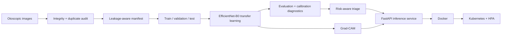

# OtoVision-MLOps

[](https://github.com/singhankitsrf/Otovision-MLOps/actions/workflows/ci.yml)  

**Production-oriented otoscopic image classification, uncertainty-aware referral, explainability, API serving, Docker, Kubernetes, and CI.**

> **Portfolio / research project only. Not a medical device and not intended for autonomous clinical diagnosis.**

## Why this repository exists

OtoVision-MLOps demonstrates an end-to-end healthcare-AI workflow rather than a single training notebook. The repository is designed to show practical competence across:

- medical-image data quality and leakage prevention
- reproducible PyTorch model training
- multiclass evaluation and probability calibration diagnostics
- confidence/entropy-based human-review routing
- Grad-CAM explainability
- FastAPI inference serving
- Docker and Kubernetes deployment
- automated testing and GitHub Actions CI
- model/data documentation and responsible-AI boundaries

## Dataset snapshot

The source archive contains **3,000 JPEG otoscopic images** distributed across five folders:

| Class | Images in archive |
|---|---:|
| Acute Otitis Media | 600 |
| Cerumen Impaction | 600 |
| Chronic Otitis Media | 600 |
| Myringosclerosis | 600 |
| Normal | 600 |

### Leakage audit

An archive-level CRC audit identified **78 repeated-content groups (156 files total)**, all within the Acute Otitis Media folder. This means a naïve random split can place identical content into both training and evaluation sets.

The project therefore computes **SHA-256 after extraction**, keeps one canonical copy for modeling, and performs stratified splitting only after exact-duplicate removal. Archive CRC is used only as an initial warning signal; SHA-256 is the training-time source of truth.

See [`docs/DATASET_AUDIT.md`](docs/DATASET_AUDIT.md).

## Architecture



## Repository structure

```text
otovision-mlops/
├── src/otovision/             # reusable Python package
├── scripts/                   # data prep, train, evaluate, explain, export
├── configs/                   # experiment configuration
├── tests/                     # unit tests
├── deploy/k8s/                # Kubernetes manifests
├── docs/                      # architecture, audit, model card, responsible AI
├── data/                      # metadata only; images are intentionally excluded
├── artifacts/                 # generated locally; excluded from Git
├── Dockerfile
├── docker-compose.yml
├── Makefile
└── .github/workflows/ci.yml
```

## 1. Prepare the environment

Python 3.10+ is recommended.

```bash
python -m venv .venv
```

Windows:

```powershell
.venv\Scripts\activate
```

Linux/macOS:

```bash
source .venv/bin/activate
```

Install:

```bash
pip install --upgrade pip
pip install -e ".[dev]"
```

## 2. Place the dataset locally

Do **not** commit medical images or the original archive unless redistribution rights are explicit and documented.

Extract the dataset so the local structure is:

```text
data/raw/Otoscopic_Data/
├── Acute Otitis Media/
├── Cerumen Impaction/
├── Chronic Otitis Media/
├── Myringosclerosis/
└── Normal/
```

## 3. Run data QA and create leakage-aware splits

```bash
python scripts/prepare_dataset.py \
  --data-root data/raw/Otoscopic_Data \
  --manifest artifacts/manifests/dataset_manifest.csv \
  --split-seed 42
```

This command:

1. verifies readable image files;
2. records image dimensions and mode;
3. computes SHA-256;
4. flags exact duplicates;
5. keeps a canonical item from each exact-duplicate group;
6. creates stratified 70/15/15 train/validation/test splits.

If patient or examination identifiers become available, replace image-level splitting with a **grouped patient-level split**.

## 4. Train

```bash
python scripts/train.py --config configs/train.yaml
```

The default backbone is **EfficientNet-B0**, chosen as a strong, deployable transfer-learning baseline. The training pipeline includes AdamW, cosine annealing, label smoothing, AMP when CUDA is available, early stopping, deterministic seeds, and best-checkpoint selection by macro F1.

TensorBoard logs:

```bash
tensorboard --logdir artifacts/runs
```

## 5. Evaluate

```bash
python scripts/evaluate.py \
  --config configs/train.yaml \
  --checkpoint artifacts/models/best.pt
```

Evaluation produces accuracy, balanced accuracy, macro/weighted precision, recall and F1, multiclass ROC-AUC, per-class sensitivity/specificity, confusion matrix, reliability diagram, ECE, multiclass Brier score, and selective-coverage analysis.

**No performance number is hard-coded in this repository.** Metrics are written only after the model is actually trained and evaluated.

## 6. Explain a prediction

```bash
python scripts/explain.py \
  --checkpoint artifacts/models/best.pt \
  --image "path/to/example.jpg" \
  --output artifacts/explanations/example_gradcam.png
```

## 7. Run the API

```bash
export MODEL_PATH=artifacts/models/best.pt
uvicorn otovision.api:app --host 0.0.0.0 --port 8000
```

Endpoints: `GET /health`, `POST /predict`.

## 8. Docker

```bash
docker build -t otovision-mlops:latest .
```

## 9. Kubernetes

```bash
kubectl apply -f deploy/k8s/
```

The supplied manifests include a Deployment, Service, HPA, health probes, and resource requests/limits.

## 10. Test and lint

```bash
pytest -q
ruff check .
```

## What this project demonstrates to hiring teams

| Capability | Evidence in repository |
|---|---|
| Applied computer vision | transfer-learning classifier |
| Healthcare AI judgment | leakage audit, review routing, model card |
| ML engineering | reusable package + configuration |
| Responsible deployment | uncertainty and human-review path |
| Explainable AI | Grad-CAM |
| API engineering | FastAPI |
| MLOps | Docker, Kubernetes, HPA |
| Software quality | pytest, Ruff, GitHub Actions |
| Reproducibility | deterministic split, config, generated artifacts |

## Citation and data licensing

The code is released under the MIT License. **Dataset licensing is separate from code licensing.** Before making any image public, document the source, redistribution terms, provenance, de-identification status, and permitted use.

## Author

**Ankit Kumar Singh**

Healthcare AI • Applied Machine Learning • Medical Imaging • MLOps

## Hugging Face deployment and evaluation

See [deployment instructions](docs/HUGGING_FACE.md) and the `hf_space/` application.
The `evaluation/` directory distinguishes measured results from pending image-model evaluation.
