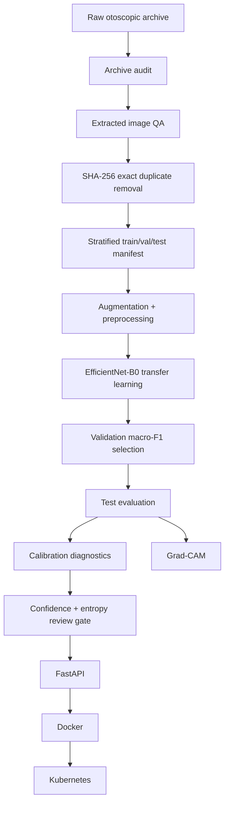

# Architecture

## Design decisions

### Exact-duplicate handling

The archive has repeated content. Splitting before duplicate removal creates a
high risk of train/test leakage, so SHA-256 grouping precedes the split.

### Backbone

EfficientNet-B0 is used as a deployable baseline. It is not presented as a
novel architecture; the project value is the full lifecycle around it.

### Referral logic

Maximum softmax confidence alone is not treated as a guarantee of correctness.
The serving layer also exposes normalized entropy and can route uncertain
outputs for human review.

### Deployment

The API is stateless except for a read-only model checkpoint, so it can scale
horizontally behind a service. The Kubernetes example uses readiness/liveness
probes and an HPA.
